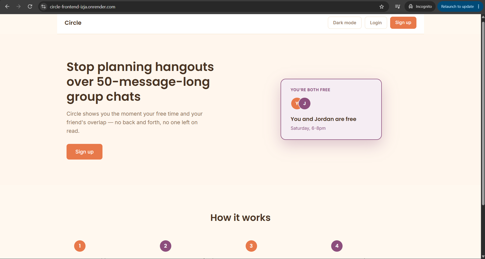
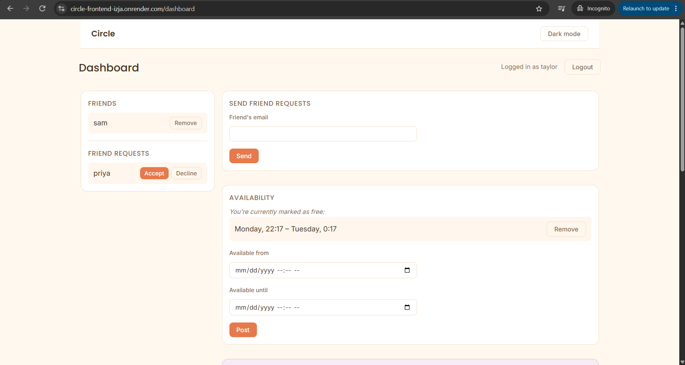

# Circle

A social coordination app: mark yourself free, get matched with friends whose availability overlaps, and get invited to (or propose) outings — without a WhatsApp group chat argument.

**[Live demo](https://circle-frontend-izja.onrender.com)** — the backend is on a free tier and spins down when idle, so the first request after a quiet stretch can take up to a minute to wake back up. Totally normal, not broken.



## Why this exists

Organizing a hangout usually means a group chat, everyone slowly replying with their availability, and someone eventually giving up and picking a time anyway. Circle flips that: mark yourself free, and if a friend's availability overlaps with yours, you both find out at the same time — the "mutual reveal" is deliberate, borrowed from how dating apps avoid the social risk of a one-sided "I said I was free and nobody responded."

## Features

- **Auth** — signup/login with bcrypt-hashed passwords and JWT sessions
- **Friends** — send/accept/decline friend requests by email, remove a friend later
- **Availability** — post a free-time window, remove it if plans change, get matched automatically with any friend whose window overlaps (showing the exact overlapping time, not just that a match exists)
- **Outings** — propose an outing to a set of friends, accept/decline invites, jump straight from a match into a pre-filled outing with "Plan something," see confirmed plans in one place, leave or delete an outing later
- **Display names** — an optional username shown in place of email everywhere identity appears, falling back to email when unset
- **Dark mode** — follows your OS/browser setting automatically, with a manual toggle in the nav

## Testing & reliability

- **Automated tests** (`pytest`) — unit tests on core logic plus real integration tests using FastAPI's `TestClient` against the actual app (signup → friend → match → outing → accept → leave/delete, end to end)
- **CI** (GitHub Actions) — every push runs the full test suite and a frontend lint + build check
- **Database-level safeguards against race conditions** — a partial unique index prevents two near-simultaneous requests from creating duplicate active friendships, a unique constraint prevents duplicate outing invites, and outing creation is a single atomic transaction so a mid-request failure can't leave an outing with no invites

## Screenshots

| Homepage | Dashboard |
|---|---|
|  |  |

## Tech stack

- **Backend:** Python, FastAPI, SQLAlchemy, PostgreSQL, Alembic migrations, JWT auth
- **Frontend:** React (Vite), react-router-dom, plain JavaScript/JSX, hand-written CSS
- **Infra (local):** Docker Compose (backend + database), GitHub Actions (CI)
- **Infra (deployed):** Render (backend web service + static frontend site), Neon (serverless PostgreSQL)

## Getting started

Requires Docker and Node.js installed locally.

1. Clone the repo and copy the example environment file:
   ```bash
   cp .env.example .env
   ```
2. Start the database and backend:
   ```bash
   docker compose up -d
   ```
3. Run database migrations:
   ```bash
   docker compose exec backend alembic upgrade head
   ```
4. Install and start the frontend:
   ```bash
   cd frontend
   npm install
   npm run dev
   ```
5. Open `http://localhost:5173`. The API runs at `http://localhost:8000` (interactive docs at `/docs`).

## Roadmap

Deliberately out of scope for now, but the current design leaves room for them:

- **Circles** — sub-groups of friends (close friends vs. wider circle), for finer-grained availability sharing
- **Location/venue presets** — attach preferred hangout spots to an outing proposal
- **Recurring availability** — "free every Sunday afternoon" instead of one-off windows

## Status

Actively built as a learning project and CV piece — see [PROGRESS.md](PROGRESS.md) for a full session-by-session log of what was built, what broke, and what was learned along the way.
