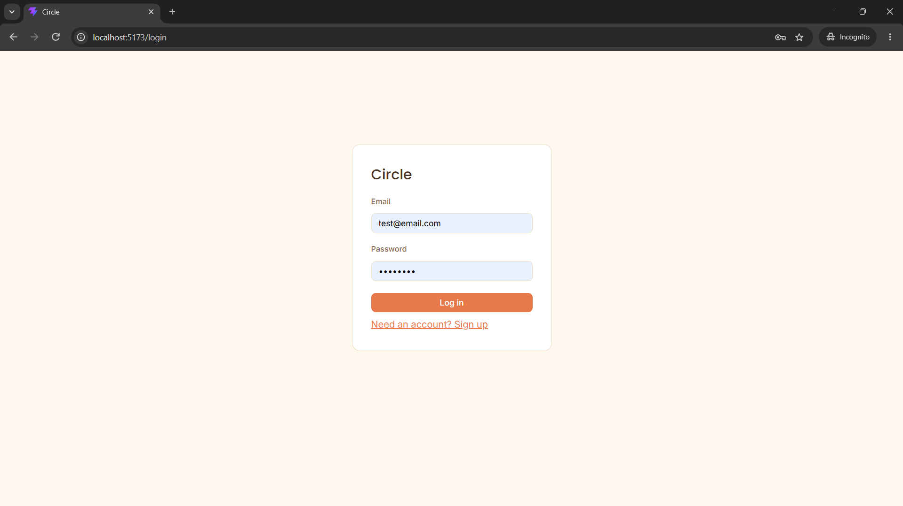

# Circle

A social coordination app: mark yourself free, get matched with friends whose availability overlaps, and get invited to (or propose) outings — without a WhatsApp group chat argument.


## Why this exists

Organizing a hangout usually means a group chat, everyone slowly replying with their availability, and someone eventually giving up and picking a time anyway. Circle flips that: mark yourself free, and if a friend's availability overlaps with yours, you both find out at the same time — the "mutual reveal" is deliberate, borrowed from how dating apps avoid the social risk of a one-sided "I said I was free and nobody responded."

## Features

- **Auth** — signup/login with bcrypt-hashed passwords and JWT sessions
- **Friends** — send/accept/decline friend requests by email
- **Availability** — post a free-time window, get matched automatically with any friend whose window overlaps
- **Outings** — propose an outing to a set of friends, accept/decline invites

## Screenshots

| Login | Dashboard |
|---|---|
|  |  |

## Tech stack

- **Backend:** Python, FastAPI, SQLAlchemy, PostgreSQL, Alembic migrations, JWT auth
- **Frontend:** React (Vite), react-router-dom, plain JavaScript/JSX, hand-written CSS
- **Infra:** Docker Compose (backend + database), GitHub Actions (CI, planned)

## Getting started

Requires Docker and Node.js installed locally.

1. Clone the repo and copy the example environment file:
   ```bash
   cp .env.example .env
   ```
2. Start the database and backend:
   ```bash
   docker compose up -d
   ```
3. Run database migrations:
   ```bash
   docker compose exec backend alembic upgrade head
   ```
4. Install and start the frontend:
   ```bash
   cd frontend
   npm install
   npm run dev
   ```
5. Open `http://localhost:5173`. The API runs at `http://localhost:8000` (interactive docs at `/docs`).

## Roadmap

Deliberately out of scope for now, but the current design leaves room for them:

- **Circles** — sub-groups of friends (close friends vs. wider circle), for finer-grained availability sharing
- **Location/venue presets** — attach preferred hangout spots to an outing proposal
- **Recurring availability** — "free every Sunday afternoon" instead of one-off windows
- Deployment, automated tests, CI

## Status

Actively built as a learning project and CV piece — see [PROGRESS.md](PROGRESS.md) for a full session-by-session log of what was built, what broke, and what was learned along the way.
